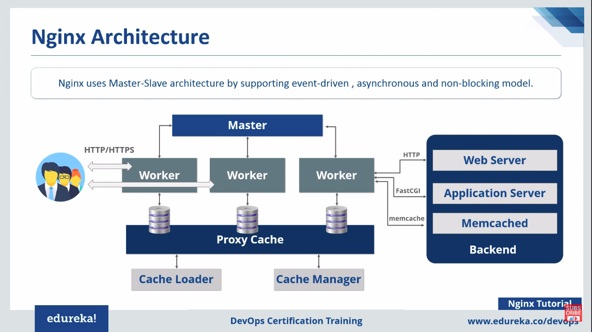

# OVERVIEW

## WEB SERVER APPACHE

Web server are computers which delivers the requested web pages.Every web server has an IP address and a Domain Name. EG:(XAMPP,Apache,NGINX,Tornado,Caddy,Microsoft IIS)

## NGINX

* NGINX is open source software for web serving,reverse proxying,Caching, load balancing ,media streaming and more.Its web server designed for maximum performance and stability
* Nginx can also function us proxy server for email(IMAP,POP3 AND SMTP) and a reverse proxy and Load balancer for HTTP,TCP and UDP servers.

## BASIC COMMANDS

* Sudo systemctl status nginx
* Sudo systemctl stop nginx
* Sudo systemctl start nginx
* Sudo systemctl reload nginx

server {
    location / {
        root /data/www;
    }

    location /images/ {
        root /data;
    }
}

# INSTALLATIION

## SERVER OVERVIEW

* Created an Instance in EC2 with the enabling PORT 20,80,443
* By using the Public IP of EC2 instance login into machine using SS H command  
  Eg:sudo ssh -i/home/sarath/Downloads/EC2Tutorial.pem ubuntu@52.66.105.255
         
## INSTALLING WITH A PACKAGE MANAGER 

  UBUNTU
* sudo apt-get update -clear
* sudo apt-get install nginx -clear
* ps aux | grep nginx (navigate to browser using IP into Nginx page)
* ls -l /etc/nginx/ (To see conf files in nginx)
* Download the nginx mainline version for nginx.org website.
* wget (paste the link of mainline version) 
* ls -l
* tar -zxvf (paste tar file. eg:nginx -1.13.10.tar.gz)
* ls -l
* cd nginx-(type version as above)
* we need to install a compiler to compile source code
* sudo apt-get install build-essential   -clear (to test ./configure)
* sudo apt-get install libpcre3 libpre3-dev zlib1g zlib1g-dev libssl-dev(pcre library)

## CUSTOM CONFIGURATION COMMAND

* sudo ./configure --sbin-path=/usr/bin/nginx --conf-path=/etc/nginx/nginx.conf --error-log-path=/var/log/nginx/error.log --http-log-path=/var/log/nginx/access.log --with-pcre --pid-path=/var/run/nginx.pid --with-http_ssl_module
* Make
* sudo install make    --ls -l /etc/nginx (to check the conf file exit)
* nginx     --ps aux | grep nginx

## SYSTEMD SERVICE(Managing a better way Nginx)

* ps aux | grep nginx (check nginx is running)
* nginx -h (commands for help version)
* nginx -s stop    ----ps aux | grep nginx
* touch /lib/systemd/system/nginx.service
* sudo nano /lib/systemd/system/nginx.service
* systemctl start nginx
* ps aux | grep nginx
* systemctl stop nginx(load the web page)
* systemctl enable nginx
* reboot   (To login again type ssh command)